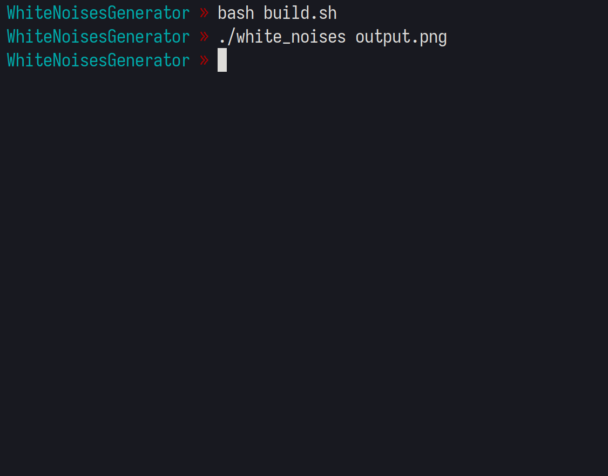
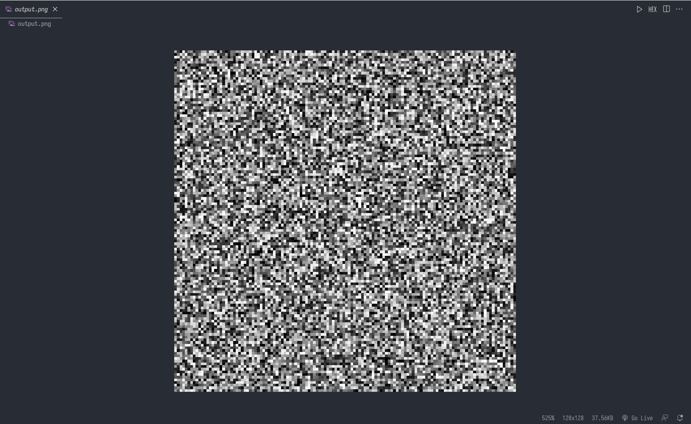

# White noises
It's an simple program written in C++ that generate white noise PNG image, it is using stb image and stb image write libraries that helps me to easier write into PNG file
# Screenshots


# How to build it?
You need to have installed clang++ or if you want an other c++ compiler you need to change it in `build.sh`, example command to build this program
```bash
bash build.sh
./white_noises # And that's it
```
